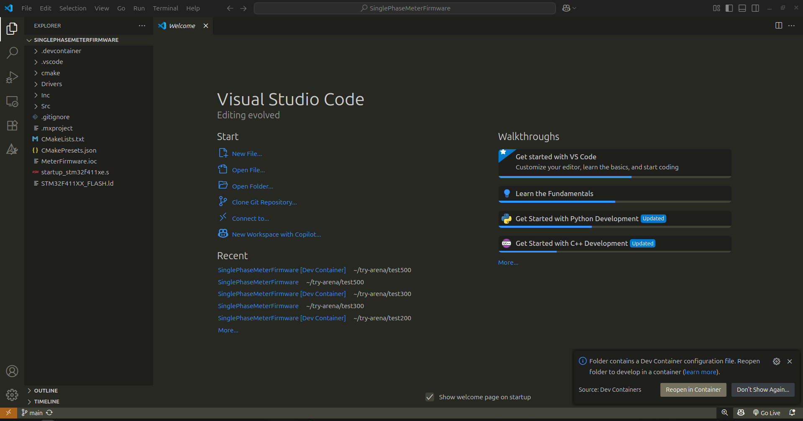
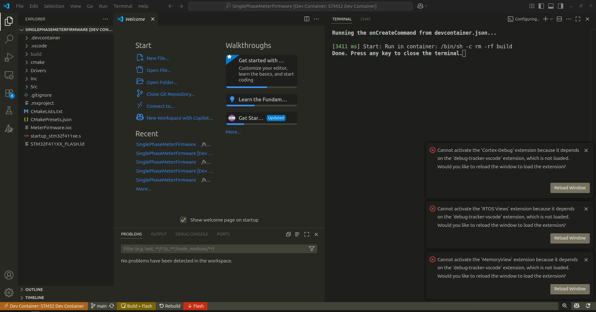
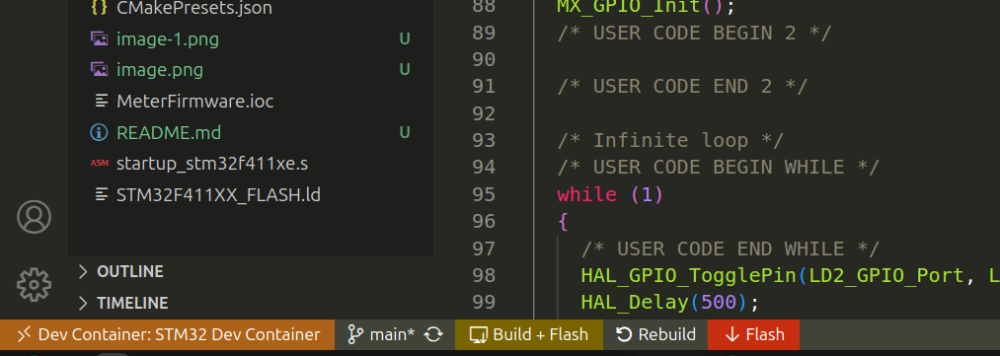
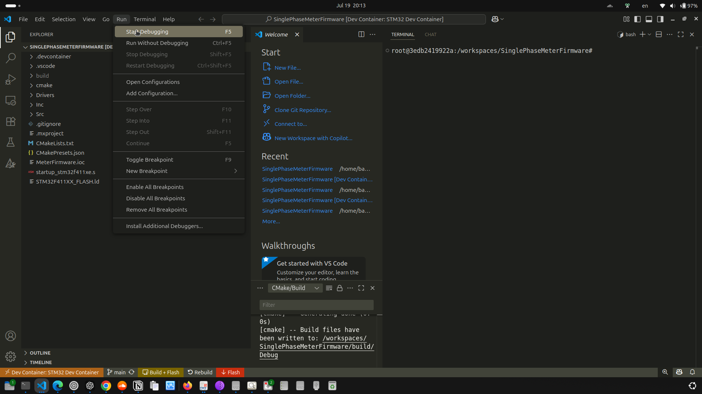
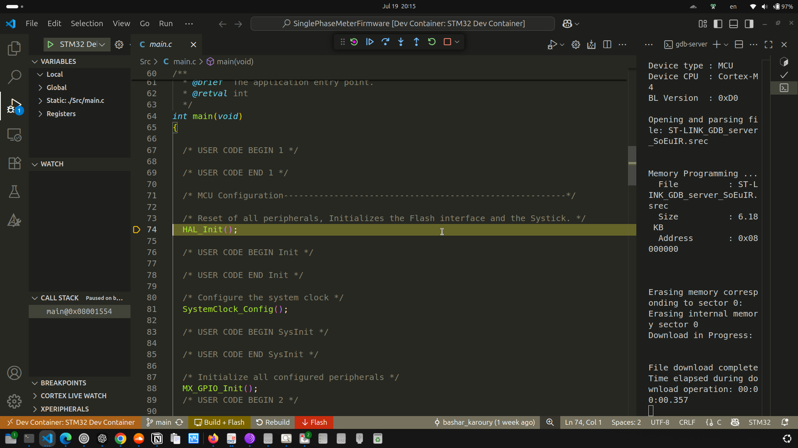

# STM32 Embedded Development Environment

This project provides a ready-to-use development environment for STM32 firmware development using **Docker** and **VS Code Dev Containers**. It includes toolchain setup, VS Code extensions, and pre-configured debugging, flashing, and build tasks.

---

## 🚀 Development Environment Setup

Follow these steps to get started:

### ✅ Prerequisites

Before you begin, make sure the following are installed on your system:

- [Docker](https://www.docker.com/products/docker-desktop)
- [Visual Studio Code](https://code.visualstudio.com/)
- [Dev Containers extension](https://marketplace.visualstudio.com/items?itemName=ms-vscode-remote.remote-containers)

You can verify the Dev Containers extension is installed by checking in the **Extensions** sidebar of VS Code.

---

### 🛠️ Launching the Dev Environment

1. **Clone the Repository**:

   ```bash
   git clone https://github.com/bashar-karoury/SinglePhaseMeterFirmware.git
   cd SinglePhaseMeterFirmware
   ```

2. **Open the Project in VS Code**:

   ```bash
   code .
   ```

3. **Reopen in Dev Container**:

   When prompted by VS Code, click **"Reopen in Container"**. 
   

   This will:
   - Build the Docker image (first time only), there is a customized built Docker image for this dev environment 
   [`ghcr.io/bashar-karoury/stm32-dev:latest`](https://github.com/users/bashar-karoury/packages/container/package/stm32-dev)
   - Install required extensions
   - Open your code inside the development container

4. **Reload May Be Required**

   
   ⚠️ On the first build, the `Cortex-Debug` extension may require a **reload** to initialize its native dependencies correctly. If you see errors or debugging doesn't work as expected you should click on reload OR you can open the Command Palette and run:

   ```
   Developer: Reload Window
   ```

---

### 🧰 Build, Debug, Rebuild, Flash

Convenient buttons are added to the **bottom status bar** for:

- ✅ **Build** – Compiles the project.
- 🔁 **Rebuild** – Cleans and rebuilds the firmware.
- ⚡ **Flash** – Uploads the binary to the connected STM32 target device.



- 🧪 **Debug** – Starts the debugger using the selected `.elf` binary and configuration.


---

## Included In Docker Image

- STM32 toolchain (`arm-none-eabi-gcc`)
- STLink tools, ST-CLT-Programmer
- Preinstalled VS Code extensions
- Task automation (build, flash, rebuild)
- Debug configurations for STM32
